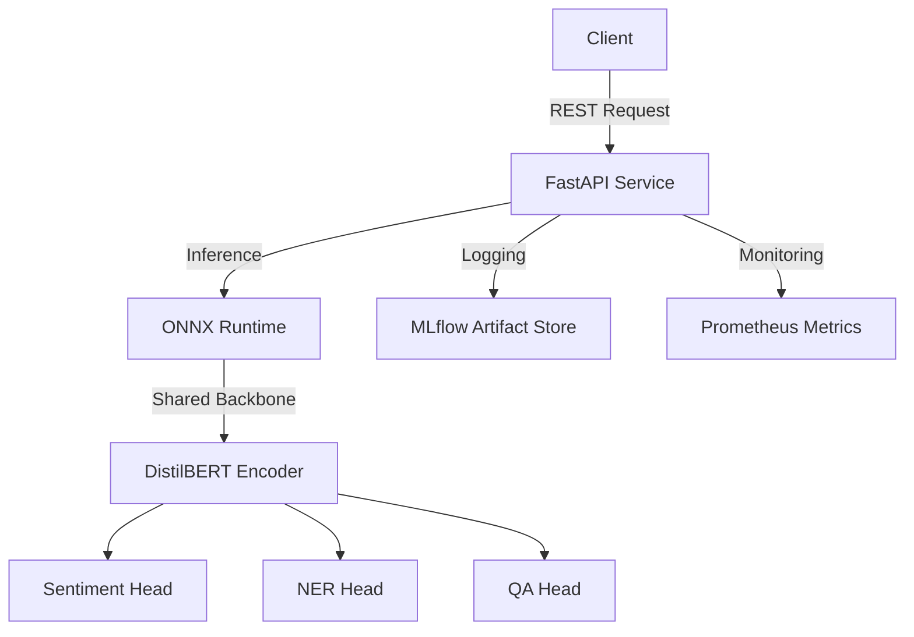

# 🤖 Multi-Task NLP API: Sentiment, NER, and QA

This repository contains a production-grade **Multi-Task NLP System** designed for high-performance inference and robust experiment tracking. It utilizes a single **DistilBERT** backbone fine-tuned to perform **Sentiment Analysis**, **Named Entity Recognition (NER)**, and **Extractive Question Answering (QA)** simultaneously.

---

## 🧰 Tech Stack

* **Core:** Python 3.10, PyTorch, Hugging Face Transformers
* **Backbone Model:** `distilbert-base-uncased`
* **Inference Optimization:** ONNX & ONNX Runtime
* **API Framework:** FastAPI & Uvicorn
* **MLOps & Tracking:** MLflow
* **Monitoring:** Prometheus
* **Infrastructure:** Docker & Docker Compose

---

## 🏗 Project Architecture

The system follows a **Hard Parameter Sharing** approach, where a shared transformer encoder reduces the memory footprint and latency compared to running three separate models.



---

## ⚡ Quick Start

### 1. System Requirements

* **RAM:** Minimum 6GB (8GB recommended for training).
* **Environment:** Docker Desktop with WSL2 backend (Windows) or Docker Engine (Linux/Mac).
* **Network:** Internet access required for initial dataset and model downloads.

### 2. Configuration

Ensure your `.env` file exists in the root (based on `.env.example`):

```bash
MLFLOW_TRACKING_URI=http://mlflow:5000
MLFLOW_EXPERIMENT_NAME=MultiTaskNLP

```

### 3. Launch

Run the following command to build the services, trigger the training pipeline, and start the API:

```bash
docker-compose up --build

```

---

## 📡 API Endpoints & Usage

### ⚙️ Model Loading Logic

On startup, the FastAPI application performs a **dynamic handshake** with the MLflow tracking server. It retrieves the latest successful run, downloads the `onnx/model.onnx` artifact, and initializes an **ONNX Runtime session** for CPU-optimized inference.

| Endpoint | Method | Input Sample |
| --- | --- | --- |
| `/predict/sentiment` | `POST` | `{"text": "I love this project"}` |
| `/predict/ner` | `POST` | `{"text": "Apple is buying a startup in London"}` |
| `/predict/qa` | `POST` | `{"context": "...", "question": "..."}` |
| `/metrics` | `GET` | Scrapable Prometheus text format |
| `/health` | `GET` | Readiness check for the ONNX session |

---

## 🧠 Training & MLOps Pipeline

### Data Processing

The `src/preprocess.py` script automatically fetches and formats the **SST-2**, **CoNLL-2003**, and **SQuAD** datasets into a unified JSON schema saved in `data/processed/`.

### Experiment Tracking

The `src/train.py` script logs the following to **MLflow**:

* **Parameters:** Learning rate, epochs, batch size, and backbone model name (`distilbert-base-uncased`).
* **Artifacts:** Full PyTorch model directory, exported ONNX graph, and `metrics.json`.
* **Optimization:** The model is exported with **dynamic axes**, allowing the API to handle variable sequence lengths.

---

## ⚠️ Known Limitations & Design Choices

* **Training Duration:** To ensure the system remains within standard evaluation timeframes and container resource limits, the model is configured for **5 epochs** on a 500-sample slice per task.
* **Resource Constraints:** The training data is intentionally sampled to prevent **Docker Exit Code 137 (OOM)** during the shared-memory-intensive training phase.
* **Inference Focus:** The system is strictly optimized for **CPU inference** using ONNX Runtime, making it ideal for cost-effective cloud deployments where GPUs are unavailable.

---

## 📊 Monitoring

Prometheus metrics are exposed at `/metrics`.

* `api_requests_total`: Labeled by endpoint path.
* `api_request_latency_seconds`: Histogram for tracking P95/P99 response times.

---

